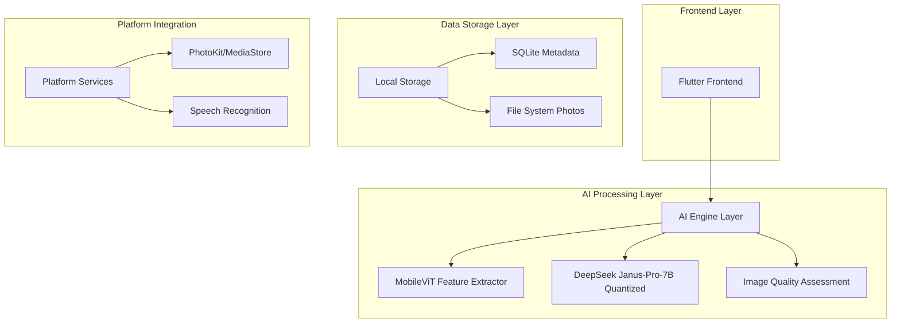

## 1. 架构设计



## 2. 技术描述

### 核心技术栈
- **跨平台框架**: Flutter 3.x + Dart
- **AI推理引擎**: llama.cpp + GGUF格式量化模型
- **图像处理**: C++原生模块通过FFI调用
- **本地数据库**: SQLite + sqflite
- **语音识别**: 系统原生API (iOS Speech Framework / Android SpeechRecognizer)

### 模型架构
- **特征提取**: MobileViTv2 (轻量级视觉Transformer)
- **多模态理解**: DeepSeek Janus-Pro-7B (4-bit量化，~3GB)
- **质量评估**: 自定义轻量CNN模型
- **语音处理**: 本地ASR模型 (Whisper Tiny量化版)

## 3. 路由定义

| 路由路径 | 页面功能 | 核心模块 |
|---------|---------|---------|
| / | 空间分析首页 | 存储概览、文件类型分析 |
| /cleanup | 智能清理页 | 重复照片、截图、低质量清理 |
| /selection | 专业选片页 | 相似组分析、摄影质量评估 |
| /voice | 语音控制页 | 语音识别、自然语言指令 |
| /settings | 设置页面 | 模型管理、偏好设置 |
| /recycle-bin | 回收站页面 | 已删除照片恢复 |

## 4. 核心数据模型

### 照片元数据结构
```typescript
interface PhotoMetadata {
  id: string;
  filePath: string;
  fileSize: number;
  width: number;
  height: number;
  creationDate: Date;
  location?: {
    latitude: number;
    longitude: number;
  };
  hash: string; // 用于重复检测
  aiAnalysis?: {
    qualityScore: number;
    blurScore: number;
    exposureScore: number;
    compositionScore: number;
    emotionScore: number;
    sceneCategory: string;
    faces: Face[];
  };
}

interface SimilarityCluster {
  id: string;
  photos: PhotoMetadata[];
  clusterType: 'duplicate' | 'similar' | 'burst';
  bestPhotoId: string;
  recommendedDeletions: string[];
}
```

### AI分析结果结构
```typescript
interface AICleanupSuggestion {
  duplicates: SimilarityCluster[];
  screenshots: PhotoMetadata[];
  lowQuality: PhotoMetadata[];
  totalSpaceReclaimable: number;
  confidence: number;
}

interface ProfessionalSelection {
  photo: PhotoMetadata;
  scores: {
    sharpness: number;
    exposure: number;
    composition: number;
    color: number;
    moment: number;
  };
  recommendation: 'keep' | 'delete' | 'review';
  reasoning: string;
}
```

## 5. 性能优化策略

### 模型推理优化
- **分层推理**: 轻量模型快速过滤 → 大模型深度分析
- **智能缓存**: 相同照片不重复分析，特征向量本地缓存
- **批处理**: 后台分批处理，避免阻塞UI
- **内存管理**: 动态加载模型分片，避免OOM

### 存储优化
- **特征压缩**: 图像特征向量使用PCA降维存储
- **增量更新**: 仅分析新添加照片，避免全库扫描
- **数据库索引**: 在creationDate、hash、sceneCategory上建立索引

### 电池优化
- **充电时处理**: 大模型推理仅在充电且WiFi连接时执行
- **低功耗模式**: 检测到电量低时降低处理精度
- **后台限制**: 遵循系统后台任务限制，使用WorkManager/BGTask

## 6. 隐私保护机制

### 数据安全
- **完全离线**: 所有AI处理在设备本地完成
- **权限最小化**: 仅请求必要的照片访问权限
- **数据隔离**: 应用数据存储在独立沙盒中
- **加密存储**: 敏感元数据使用SQLCipher加密

### 用户控制
- **透明决策**: 显示AI决策的具体理由和评分
- **手动覆盖**: 用户可手动调整AI推荐结果
- **偏好学习**: 记录用户选择，优化个性化推荐
- **完全删除**: 提供彻底删除选项，不保留任何副本

## 7. 跨平台实现细节

### Flutter架构
```
lib/
├── core/           # 核心业务逻辑
│   ├── ai/        # AI模型管理
│   ├── photo/     # 照片处理
│   └── storage/   # 存储管理
├── ui/            # UI组件
│   ├── screens/   # 页面
│   ├── widgets/   # 自定义组件
│   └── theme/     # 主题样式
├── platform/      # 平台相关
│   ├── ios/       # iOS特定实现
│   ├── android/   # Android特定实现
│   └── channels/  # 平台通道
└── models/        # 数据模型
```

### 原生模块集成
- **iOS**: 使用Swift编写PhotoKit扩展，通过Platform Channel通信
- **Android**: 使用Kotlin编写MediaStore扩展，支持Scoped Storage
- **C++**: 图像处理算法编译为原生库，通过FFI直接调用
- **模型推理**: iOS使用Core ML，Android使用TFLite Native API