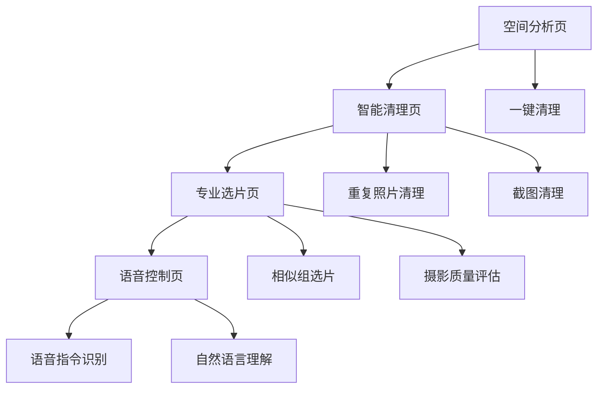

## 1. 产品概述

Cullery（览羲）是一款基于AI的离线跨平台照片智能管理应用，通过本地多模态大模型实现专业级照片筛选与自动整理，解决用户照片堆积、选择困难和存储空间不足的核心痛点。

产品核心价值：100%隐私优先的离线AI照片策展人，让用户从海量照片中轻松保留最珍贵的记忆瞬间。

## 2. 核心功能

### 2.1 用户角色
| 角色类型 | 使用场景 | 核心需求 |
|---------|---------|---------|
| 普通用户 | 手机照片堆积，存储空间不足 | 快速清理重复/模糊/截图照片 |
| 摄影爱好者 | 专业照片筛选，追求画质 | 基于摄影美学标准智能选片 |
| 家庭用户 | 家庭照片整理，回忆管理 | 智能识别重要时刻和人物 |

### 2.2 功能模块

MVP核心功能包括以下页面：

1. **空间分析页**：存储空间可视化分析，快速识别大文件和重复内容
2. **智能清理页**：一键清理重复照片、截图、模糊照片，释放存储空间
3. **专业选片页**：基于摄影美学标准（清晰度、曝光、构图）推荐最佳照片
4. **语音控制页**：通过自然语言指令执行照片管理操作

### 2.3 页面详情

| 页面名称 | 模块名称 | 功能描述 |
|---------|---------|---------|
| 空间分析页 | 存储概览 | 显示照片总数量、占用空间、增长趋势图表 |
| 空间分析页 | 文件类型分析 | 分类展示截图、视频、重复文件的空间占比 |
| 空间分析页 | 清理建议 | 基于AI分析提供个性化清理建议 |
| 智能清理页 | 重复照片清理 | 智能识别完全重复和相似照片，推荐保留最佳一张 |
| 智能清理页 | 截图清理 | 自动识别截图、录屏、文档照片，批量清理 |
| 智能清理页 | 低质量清理 | 识别模糊、过曝、闭眼等技术废片 |
| 专业选片页 | 相似组选片 | 对连拍或相似场景照片进行专业维度评分 |
| 专业选片页 | 摄影质量评估 | 基于清晰度、曝光、构图、色彩、瞬间5维度评分 |
| 专业选片页 | 推荐理由 | 展示AI选片的具体理由和评分详情 |
| 语音控制页 | 语音指令识别 | 支持"删除所有截图"、"保留最清晰的一张"等指令 |
| 语音控制页 | 自然语言理解 | 理解复杂指令如"删除上周所有模糊的食物照片" |

## 3. 核心流程

### 用户首次使用流程
1. 用户打开应用，进入空间分析页查看照片存储情况
2. 系统扫描并显示重复照片、截图、低质量照片统计
3. 用户选择"一键智能清理"，系统推荐清理方案
4. 用户确认后，应用执行清理并显示释放空间
5. 用户可通过语音指令进行高级照片管理

### 专业选片流程
1. 用户选择相似照片组进行分析
2. AI从5个专业维度进行评分：清晰度30%、曝光25%、构图20%、瞬间15%、色彩10%
3. 系统推荐最佳1-3张照片并给出具体理由
4. 用户可调整权重偏好，AI学习个性化审美

## 4. 用户界面设计

### 4.1 设计风格
- **主色调**：深空灰 (#1a1a1a) + 极光绿 (#00d4aa)
- **按钮样式**：圆角矩形，微投影，悬浮效果
- **字体**：SF Pro (iOS) / Roboto (Android)，字号14-16px为主
- **布局风格**：卡片式布局，留白充足，突出内容
- **图标风格**：线性图标，简洁现代，统一2px线宽

### 4.2 页面设计概览

| 页面名称 | 模块名称 | UI设计要点 |
|---------|---------|-----------|
| 空间分析页 | 存储概览 | 圆环进度图显示空间使用，渐变色彩表示不同文件类型 |
| 空间分析页 | 文件类型分析 | 水平条形图，图标+数值清晰展示各类文件占比 |
| 智能清理页 | 重复照片清理 | 网格展示相似照片组，最佳照片边框高亮显示 |
| 专业选片页 | 摄影质量评估 | 五星评分系统，各维度评分条形图展示 |
| 语音控制页 | 语音指令识别 | 中央麦克风按钮，波纹动画表示语音识别状态 |

### 4.3 响应式设计
- **桌面优先**：针对大屏幕优化，支持拖拽操作和批量处理
- **移动端适配**：底部导航栏，单手操作友好
- **平板优化**：分屏显示，左侧导航右侧内容

### 4.4 3D场景指导
- **环境**：简洁的3D画廊空间，柔和的环境光
- **材质**：磨砂玻璃效果，轻微反射增加质感
- **动画**：页面切换使用淡入淡出，照片选择使用缩放动画
- **交互**：悬停预览，点击放大查看细节